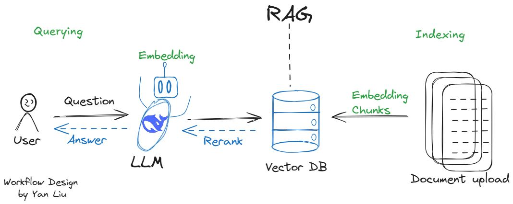

# Build RAG Chat App by Deepseek V3 🐋 and Supabase ⚡


</img> <br>

## Overview

Build RAG (Retrieval-Augmented Generation) Chat App" by integrating Deepseek V3 and Supabase, built base on a simple Streamlit application that provides an interactive user interface with a sidebar for navigation and content display. Separate projects with unique chats.

## Purpose of the Project

### 🚀 Hands-on AI & Database Integration

- Gain practical experience with modern AI models and database technologies.
- Explore the capabilities and use cases of DeepSeek V3.

### 🔍 Retrieval-Augmented Generation (RAG) Implementation

- Develop a chat application using RAG for enhanced AI responses.
- Instead of OpenAI's paid models, leverage Hugging Face's RAG model for free.

### ⚡ Tech Stack & Development

- Frameworks & Tools:
  - Streamlit → Build and deploy the app.
  - DeepSeek V3 → AI-powered model integration.
  - Supabase → Store and retrieve embeddings efficiently.
- Python Practice:

  - Work with advanced Python features.
  - Implement unit testing towards the end.

### 📄 PDF Handling & Embeddings

- Extract text from PDFs using PyMuPDF (extract_text_from_pdf function).
- For free embedding generation:

  - Sentence Transformers (sentence-transformers library).

  ```bash
  pip install sentence-transformers
  ```

  - Hugging Face Transformers for pre-trained models.

  ```bash
  pip install transformers
  ```

## Inital Technologies

- Python 3.10
- Packages `pip install streamlit requests python-dotenv supabase`
- Read DeepSeek API documentation for python `https://api-docs.deepseek.com/api/create-chat-completion`

## Workflow

1. Chat app with DeepSeek V3 and Supabase
2. Upload Document: The user uploads a document (PDF, TXT, DOCX) via the Streamlit sidebar.
3. Process Document: The document is processed into chunks of text.
4. Generate Embeddings: Embeddings are generated for each chunk using sentence-transformers.
5. Save to Supabase: The chunks and their embeddings are saved to the Supabase database.
6. Ask a Question: The user inputs a question.
7. Retrieve Relevant Chunks: The system retrieves the most relevant chunks from Supabase based on the question's embedding.
8. Generate Answer: The retrieved chunks and the question are sent to the DeepSeek API to generate an answer.
9. Display Answer: The answer is displayed to the user.

## Features

show check and square boxes for the following features

✅ Streamlit server setup <br>
✅ DeepSeek V3 API integration <br>
✅ Main Chat area for displaying information from DeepSeek works 🐋 <br>
✅ Sidebar for navigation <br>
✅ Display chat history in the main chat area <br>
✅ Supabase storage setup and API integration, schema design <br>
✅ Save chat history to Supabase, by different user and projects <br>
✅ Use the PyMuPDF library to extract text from PDF files.<br>
✅ Streamlit UI for uploading files <br>
✅ Embedding uploaded files and chunks to supabase <br>
✅ RAG model integration <br>
✅ Ask questions and get answers from RAG model <br>
✅ Retrieve chat history from Supabase <br>

```bash
Build-RAG-Chat-App/
├── .env
├── app.py
├── document_processor.py
├── requirements.txt
├── .gitignore
└── README.md
```

## Installation

To run this application, you need to have Python installed on your machine. Follow these steps to set up the project:

1. Clone the repository:

   ```
   git clone https://github.com/yanliu1111/rag_chat_app_by_deepseek_and_supabase.git
   cd rag_chat_app_by_deepseek_and_supabase
   ```

2. Install the required dependencies:
   ```
   pip install -r requirements.txt
   ```

## Create Environment Variables (.env):

```
DEEPSEEK_API_KEY=your_deepseek_api_key
SUPABASE_URL=your_supabase_url
SUPABASE_API_KEY=your_supabase_api_key
YOUR_SITE_URL=http://localhost:8501
YOUR_SITE_NAME=your_site_name
```

## Running the Application

To start the Streamlit application, run the following command in your terminal:

```
streamlit run app.py
```

## Supabase Setup

### Create tables

```sql
CREATE TABLE IF NOT EXISTS messages (
  id BIGINT GENERATED BY DEFAULT AS IDENTITY PRIMARY KEY,
  role TEXT NOT NULL,
  content TEXT NOT NULL,
  project TEXT NOT NULL,
  timestamp TIMESTAMPTZ DEFAULT timezone('utc'::text, now()) NOT NULL,
  embedding JSONB  -- Add this line
);

ALTER TABLE messages ENABLE ROW LEVEL SECURITY;

-- Create policy
CREATE POLICY "Allow all operations"
ON messages FOR ALL
USING (true)
WITH CHECK (true);
```
